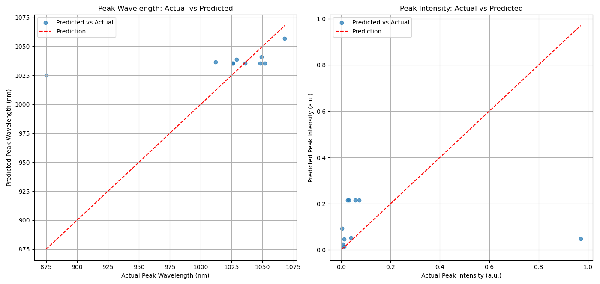

# Machine Learning Assisted Prediction for Quantum Well Photoluminescence Growth
A machine learning (ML) model used to look at photoluminescence (PL) data from our InGaAs quantum wells. This model will provide insight on future quantum wells grown by using a supervised learning agent.

## Introduction
This is a small project that extracts the peak photoluminescense (PL) and intensity out of a previously measured Quantum Well sample. Then, using a machine learning model, you can analyze this with other relevant input parameters to predict peak PL measurements for future Quantum Wells grown.

## Dependencies 
This project uses three main libraries: `RandomForestRegressor`, `GradientBoostingRegressor`, and `MultiOutputRegressor`.

For more information, please visit their respective repositories and documentation.
- [RandomForestRegressor](https://scikit-learn.org/stable/modules/generated/sklearn.ensemble.RandomForestRegressor.html)
- [GradientBoostingRegressor](https://scikit-learn.org/stable/modules/generated/sklearn.ensemble.GradientBoostingRegressor.html)
- [MultiOutputRegressor](https://scikit-learn.org/stable/modules/generated/sklearn.multioutput.MultiOutputRegressor.html)

## Virtual Environment Setup
1. Install necessary packages:
   ```bash
   pip install pandas
   pip install numpy
   pip install scikit-learn
   pip install matplotlib
   pip install openpyxl
   ```
## How to Use the Code
1. Create the Raw PL Spectra Folder
   - Inside your desired directory (e.g. `PL_ML_Project`), create a new folder named `PL_Spectra_Raw`
   - Place all your individual raw PL spectrum files (e.g., `G25-017-center.csv`, etc.) into this `PL_Spectra_Raw` folder.
   - The filename should exactly match the `QW_Sample` ID you'll use in your `quantum_well_data.xlsx` file.
   - Internal Format: Each file should have comment lines starting with #, followed by a header line (e.g., `lambda [nm]   intensity [a.u.]`), and then tab-separated numerical data.

2. Create your `quantum_well_data.xlsx` file
   - Populate this file with your actual data inputs. For example:
       - `QW_Sample`
       - `In_Fraction`
       - `WellWidth_nm`
       - etc.

3. Configure and Run the Peak Extraction Code
   ```bash
   python pl_peak_extractor.py
   ```
   - Verify a file named `extracted_pl_peaks.csv` (or `.xlsx`) appears in your `PL_ML_Project` directory.

4. Configure and Run the Machine Learning Code
   - Ensure `FEATURE_COLUMNS = ['GrowthTemp_Pyro', 'PL_Correction_Factor', etc.]` match your exact varying column names.
   - Adjust `IDEAL_PL_WAVELENGTH ` and `IDEAL_PL_INTENSITY` to your specific targets.
   - Adjust example prediciton values in the `--- Example Recipes ---` section.
   - Save the file and run:
   ```bash
   python main_ml_script.py
   ```
## Example Plots
Plot of Predicted vs Actual Wavelength & Intensity



Example of Photoluminsence Plot


   

